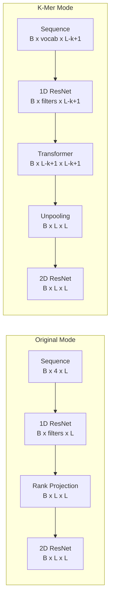

# SincFold K-Mer Model Architecture

```mermaid
flowchart TB
    subgraph INPUT
        A["RNA Sequence<br/>Length: L"]
    end

    subgraph KMER_TOKEN
        B["Split into k-mers<br/>L to L-k+1"]
        A --> B
    end

    subgraph EMBED
        C["One-Hot Encode<br/>Shape: B x 4^k x L-k+1"]
        B --> C
    end

    subgraph RESNET1D
        D["Conv1d<br/>embed to filters"]
        E["ResidualLayer1D x num_layers<br/>with dilation"]
        C --> D --> E
    end

    subgraph TRANSFORMER
        F["Linear Projection<br/>filters to transformer_dim"]
        G["TransformerEncoderLayer x layers<br/>Multi-head Self-Attention plus FFN"]
        H["Linear Projection<br/>transformer_dim to rank"]
        I["Dot Product Attention<br/>Q x K transpose over sqrt d"]
        J["Symmetrize<br/>attn plus attn transpose over 2"]
        E --> F --> G --> H --> I --> J
    end

    subgraph UNPOOL
        K["Expand: L-k+1 x L-k+1 to L x L<br/>Averaging for overlaps"]
        J --> K
    end

    subgraph PRIOR
        L{"interaction_prior<br/>equals probmat?"}
        M["Concatenate<br/>matrix plus prior"]
        N["Keep as-is"]
        K --> L
        L -->|Yes| M
        L -->|No| N
    end

    subgraph RESNET2D
        O["Conv2d<br/>mid_ch to filters"]
        P["ResidualBlock2D x 2<br/>with dilation"]
        Q["Conv2d to 1<br/>Output logits"]
        R["Apply Canonical Mask<br/>Zero invalid pairs"]
        S["Symmetrize<br/>out plus out transpose over 2"]
        M --> O
        N --> O
        O --> P --> Q --> R --> S
    end

    subgraph OUTPUT
        T["Contact Matrix<br/>Shape: B x L x L"]
        S --> T
    end
```

## Comparison: Original vs K-Mer Mode

## Key Parameters

| Parameter | Default | Description |
|-----------|---------|-------------|
| kmer_embedding | False | Use k-mer tokenization |
| kmer_size | 3 | Size of k-mer |
| transformer_layers | 2 | Number of transformer encoder layers |
| transformer_heads | 4 | Number of attention heads |
| transformer_dim | 128 | Hidden dimension of transformer |
